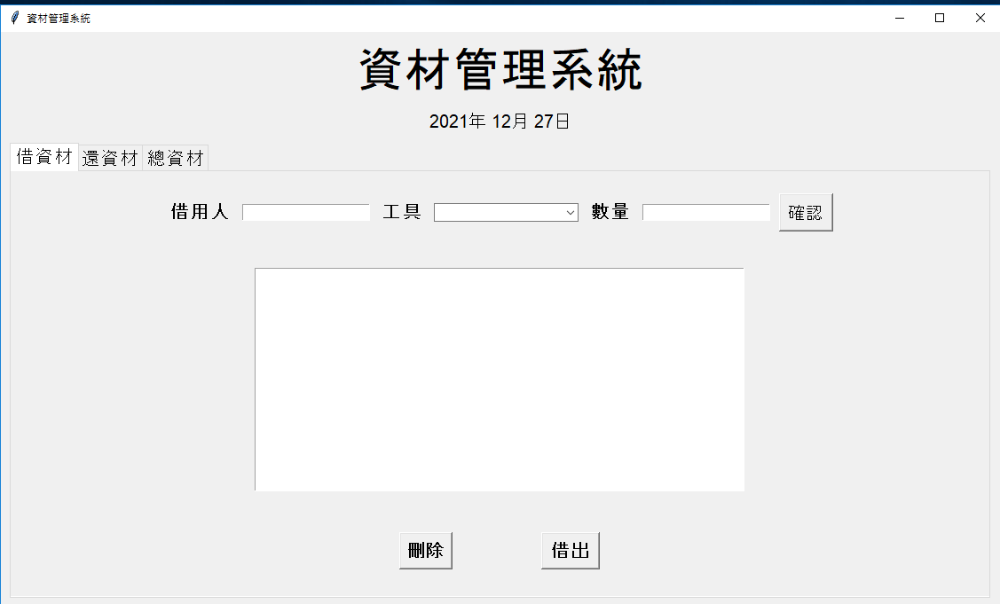

# Tool-Regulation [](https://github.com/Bliss-and-Wisdom-Senior-High-School/Tool-Regulation/stargazers)  [](https://github.com/Bliss-and-Wisdom-Senior-High-School/Tool-Regulation)

## Table of contents
* [General info](#general-info)
* [Technologies](#technologies)
* [Setup](#setup)

## General info
<h1 align="center">
    
</h1>

This project is ...
```

    .
    ├── FILEIO.PY
    ├── function.py
    ├── MAIN.PY
    ├── storage
    ├── __pycache__
    └── README.md
```
## Technologies
Project is created with:
* python 3.8.5
* tkinter
* json
	
## Setup
To run this project, install it locally using python:
```shell
cd Tool-Regulation-main
python MAIN.py
```